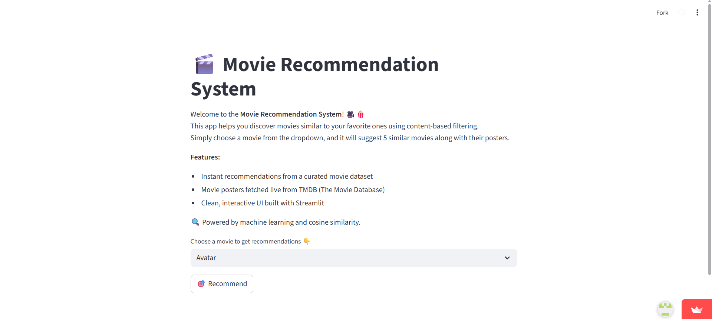

# Movie Recommendation System

A content-based movie recommendation system built with Python, Pandas, Scikit-learn, and Streamlit. This application allows users to discover similar movies based on a selected movie's genres, keywords, cast, crew, and plot overview.

---

## 🔗 Live Demo

<p>
  <a href="https://movie-recommendation-system-kixgk3ji92pq8fappsurr9b.streamlit.app/" target="_blank">
    
  </a>
</p>

---

## 🖼️ UI Preview



---

## 🚀 Features

-   **Content-Based Recommendations**: Recommends movies by analyzing their features (genres, keywords, cast, director, overview).
-   **Interactive Web Interface**: A user-friendly single-page application built with Streamlit for easy movie selection and recommendation display.
-   **Data Preprocessing Pipeline**: Robust handling of raw movie data, including parsing nested JSON-like strings and extracting key information.
-   **Cosine Similarity**: Leverages cosine similarity to quantify the likeness between movie content vectors.
-   **Scalable Architecture**: The trained model and similarity matrix are pre-computed and saved, allowing for fast recommendations in the deployed app.

---

## 🛠️ Tech Stack

-   **Web Framework**: Streamlit
-   **Machine Learning**: Scikit-learn (for `CountVectorizer`, `cosine_similarity`)
-   **Data Handling**: Pandas, NumPy, `ast` (for parsing string literals)
-   **Deployment**: Streamlit Cloud / Render / Heroku (adapt based on your choice)
-   **API (Optional, if you add later)**: `requests` (for fetching movie posters from external APIs like TMDB)

---

## 📦 Installation (Local Development)

To set up and run this project locally, follow these steps:

1.  **Clone the repository**:

    ```bash
    git clone https://github.com/NodePulse/movie-recommendation-system.git
    cd movie-recommendation-system
    ```

2.  **Create and activate a virtual environment** (recommended):

    ```bash
    python -m venv venv
    # On Windows
    .\venv\Scripts\activate
    # On macOS/Linux
    source venv/bin/activate
    ```

3.  **Install dependencies**:

    ```bash
    pip install -r requirements.txt
    ```

4.  **Download the dataset**:
    Place `tmdb_5000_movies.csv` and `tmdb_5000_credits.csv` into a `dataset/` folder in the root of your project directory.
    *(You can typically find these datasets on Kaggle or similar data science platforms, e.g., [TMDB 5000 Movie Dataset](https://www.kaggle.com/datasets/tmdb/tmdb-5000-movie-dataset))*

5.  **Setup Environment Variables (Optional for local, but essential for poster fetching)**

    Create a `.env` file in the root of your project directory and add your TMDB API key:

    ```env
    # .env
    MY_API_KEY = "YOUR_TMDB_API_KEY_HERE"
    ```
    *Note: This key is used if you uncomment the TMDB API calls in `app.py` for fetching movie posters. Make sure to get your own API key from [The Movie Database (TMDb)](https://www.themoviedb.org/documentation/api) and keep it secure. Never commit your API keys directly to public repositories.*

6.  **Run the Jupyter Notebook to preprocess data and train the model**:
    Open `project.ipynb` in your preferred Jupyter environment (Jupyter Lab, Jupyter Notebook, VS Code with Jupyter extension) and execute all cells. This process will generate two crucial files:
    * `movies.pkl`: The processed DataFrame containing clean movie data.
    * `similarity.pkl`: The cosine similarity matrix used for recommendations.

    ```bash
    jupyter notebook project.ipynb
    ```
    or
    ```bash
    jupyter lab project.ipynb
    ```

7.  **Run the Streamlit Application**:

    ```bash
    streamlit run app.py
    ```
    This command will open a new tab in your default web browser, displaying the Movie Recommendation System. The application typically runs on `http://localhost:8501/`.

---

## 📤 Deployment

This project can be easily deployed on platforms that support Streamlit applications, such as **Streamlit Community Cloud** or **Render**.

### For Streamlit Community Cloud:

1.  Ensure your `app.py`, `requirements.txt`, `movies.pkl`, `similarity.pkl`, and `dataset/` folder are all pushed to your GitHub repository.
2.  Go to [Streamlit Community Cloud](https://share.streamlit.io/).
3.  Click "New app" and connect your GitHub repository. Select the main branch and `app.py` as the main file path.
4.  If your app uses environment variables, configure them in the "Advanced settings" section during deployment.
5.  Click "Deploy!". Streamlit will handle the rest.

### For Render:

1.  Ensure all necessary files (`app.py`, `requirements.txt`, `movies.pkl`, `similarity.pkl`, and the `dataset/` directory) are committed and pushed to your Git repository.
2.  Go to your Render dashboard and create a "New Web Service".
3.  Connect your Git repository.
4.  **Runtime**: Python 3
5.  **Build Command**: `pip install -r requirements.txt` (Render usually infers this)
6.  **Start Command**: `streamlit run app.py --server.port $PORT --server.enableCORS false`
    *(Note: `--server.enableCORS false` might be needed for some deployments.)*
7.  If using environment variables (e.g., for `MY_API_KEY`), configure them in Render's environment variables section for your service.
8.  Select your desired plan type and deploy.

---

## 🔮 Future Enhancements

* Integrate with TMDB API to fetch dynamic movie posters and additional details.
* Implement a search bar for movies not in the dropdown.
* Add user ratings/feedback functionality to improve recommendations over time (hybrid system).
* Explore more advanced recommendation algorithms (e.g., matrix factorization).

---

## 🤝 Contributing

Contributions are highly welcome! If you have ideas for improvements, bug fixes, or new features, please follow these steps:

1.  Fork the repository.
2.  Create a new branch (`git checkout -b feature/your-feature`).
3.  Commit your changes (`git commit -m 'Add new feature'`).
4.  Push to the branch (`git push origin feature/your-feature`).
5.  Open a Pull Request, describing your changes in detail.

---

## 🙌 Acknowledgements

-   [Streamlit](https://streamlit.io/): For making it easy to build interactive web apps.
-   [Scikit-learn](https://scikit-learn.org/): For powerful machine learning tools.
-   [The Movie Database (TMDb)](https://www.themoviedb.org/): For providing the movie datasets.
-   [Pandas](https://pandas.pydata.org/): For efficient data manipulation.
-   [NumPy](https://numpy.org/): For numerical operations.
